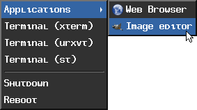

# XMenu

XMenu is a menu utility for X.
XMenu receives a menu specification in stdin, shows a menu for the user
to select one of the options, and outputs the option selected to stdout.
XMenu can be controlled both via mouse and via keyboard.

In order to generate a menu of applications based on .desktop entries,
as specified by XDG, checkout [xdg-xmenu](https://github.com/OliverLew/xdg-xmenu)
by [OliverLew](https://github.com/OliverLew).

Check out my other project, [xclickroot](https://github.com/phillbush/xclickroot) for an application that can
spawn xmenu by right clicking on the root window (i.e. on the desktop).

## Options
XMenu understand the following command-line options.

* `-f`:           Enable file system navigation.
* `-N name`:      Specify a resource/instance name for XMenu.
* `-p position`:  Specify a position to place XMenu.
* `-t window`:    Bind XMenu to given window.
* `-w`:           Initiate XMenu as a regular window.
* `-x button`:    Run XMenu whenever button is pressed on root window.

## Environment
XMenu understands the following environment variable.

* `ICONPATH`: Colon-separated list of directories to search for images.

## Input
XMenu reads menu entries from standard input.
Each entry correspond to a line; and lines can be indented to represent
submenus.  Tab separates the label from the string to be output.  An
optional image can be inserted on the line to be rendered as the entry's
icon.

For example, the following input...

```
Applications
	IMG:./icons/web.png	Web Browser	firefox
	IMG:./icons/gimp.png	Image editor	gimp
Terminal (xterm)	xterm
Terminal (urxvt)	urxvt
Terminal (st)		st

Shutdown		poweroff
Reboot			reboot
```

...generates the following menu:



An example script can be found at `./examples/xmenu.sh`.

## Customization
XMenu can be customized by setting the following X resources before
invoking XMenu.

* `XMenu.activeBackground`: Background color for selected entry.
* `XMenu.activeForeground`: Text color for selected enty.
* `XMenu.alignment`:        Text alignment.
* `XMenu.background`:       Background color.
* `XMenu.borderColor`:      Border color.
* `XMenu.borderWidth`:      Border size.
* `XMenu.faceName`:         Font for drawing text.
* `XMenu.faceSize`:         Font size.
* `XMenu.foreground`:       Text color.
* `XMenu.gap`:              Gap between windows.
* `XMenu.maxItems`:         Maximum number of items displayed on a menu.
* `XMenu.opacity`:          Background opacity (from 0.0 to 1.0).
* `XMenu.separatorColor`:   Separator color.
* `XMenu.shadowThickness`:  3D relief size.
* `XMenu.tearOff`:          Enable menus to be torn off.
* `XMenu.topShadowColor`, `XMenu.middleShadowColor`, `XMenu.bottomShadowColor`:
  Colors of the 3D relief.

An example style configurationcanbe found at `./examples/Xresources`.

## Installation
Run `make all` to build, and `make install` to install the binary and
the manual into `${PREFIX}` (`/usr/local`).

## Features

* XMenu reads something in and prints something out, the UNIX way.
* Submenus (some menu entries can spawn another menu).
* Torn off menus (menus can be managed by the window manager like a regular window).
* Separators (menu entries can be separated by a line).
* Icons (menu entries can be preceded by an icon image).
* X resources support (you don't need to recompile xmenu for configuring it).
* Multi-head (xmenu supports multiple monitors by using Xinerama).

## License
The code and manual are under the MIT/X license.
See `./LICENSE` for more information.

## Acknowledgements

* [thingmenu](http://r-36.net/scm/thingmenu/log.html) for being the base
  for xmenu's code.  However, xmenu evolved enough that it no longer resembles
  thingmenu at all.
* [dmenu](https://tools.suckless.org/dmenu/) for inspiring the stdin-to-stdout
  interface, and being base for drawing routines and input method code.

## Manual

	XMENU(1)                    General Commands Manual                   XMENU(1)

	NAME
	     xmenu - menu utility for X

	SYNOPSIS
	     xmenu [-fw] [-N name] [-p position] [-t window] [-x modifier-button]
	           [title]

	DESCRIPTION
	     xmenu is a menu for X.  It reads a list of newline-separateditems from
	     standard input; shows a menu for the user to select one of the items; and
	     writes the selected item into standard output.

	     The options are as follows:

	     -f      Enable file system navigation.  If this flag is set, any menu
	             item whose output begins with a slash is interpreted as the path
	             to a directory.  Entering this item will open a menu containing
	             the entries of that directory, so the user can navigate the
	             contents of the directory with xmenu.  When an item is selected,
	             its absolute path is output prefixed with "file:".  A directory's
	             path can be output by selecting it with the middle mouse button.

	     -N name
	             Specifiy the res_name member of the XClassHint(3) property.  Ar
	             name is used to retrieve resources.  If not specified, defaults
	             to the command that xmenu was invoked as (that is, the
	             basename(3) of its argv[0]).

	     -p position
	             Set the position to spawn xmenu.  Without this option, xmenu
	             spawns next to the cursor.  Position is a string of the form
	             GEOMETRY[:MONITOR], where GEOMETRY is a geometry parsed by
	             XParseGeometry(3).  MONITOR is the number of the monitor the
	             geometry is relative to (counting from 0); it can instead be a
	             string like "current" or "cursor", specifyingthe monitor where
	             the cursor is on.

	     -t window
	             Make the menu windows transient for the given window.  That is,
	             notify the window manager that the menus are bound to the given
	             window.  This also makes xmenu close when the window is
	             destroyed.

	     -w      Asks the window manager to draw a border around the menu.  This
	             makes xmenu start torn off.

	     -x modifier-button
	             This option requires an argument of the form modifier-button or
	             button; where modifier is Mod1 to Mod5, or Alt (equivalent to
	             Mod1), or Super (equivalent to Mod4); and button is the number of
	             a mouse button.  When this option is used, xmenu listens to
	             button presses on the root window, and shows the menu when the
	             given button is pressed on the root window or when that button is
	             pressed together with the given modifier on any window.  This
	             option makes xmenu run continuously; so it should be used when
	             xmenu is invoked in background on a X11 startup file (like
	             ~/.xinitrc or ~/.xsession).  This option cannot be used together
	             with -w or -t.

	     If the argument title is given, the title of the menu window is set to
	     it.

	SYNTAX
	     Each item read from standard input has the following format (bracket
	     groups optional elements):

	           [TABS] [IMAGE TABS] LABEL [TABS OUTPUT] NEWLINE
	     or

	           [TABS] [:] NEWLINE

	     The components are as follows:

	     o   The initial tabs indicate the menu hierarchy: items indented with a
	         tab are placed in a submenu of the preceding item not indented.  An
	         item without initial tabs is a top-level item.

	     o   The image is a string of the form "IMG:/path/to/image.png".  It
	         specifies the path to an image file to be shown as icon at the left
	         of the entry.  If the path does not begin with "/", "./", or "../",
	         the file is searched on the paths specified in the ICONPATH
	         environment variable.

	     o   The label is the string that will be shown as an item in the menu.
	         An item without label or with a single colon (:) as label is
	         considered a separator and is drawn as a thin line in the menu
	         separating the item above from the item below.  An item whose label
	         is equal to two apostrophes "''" does not appear on the menu, it's
	         output provides an alternative output for the previous item when the
	         user clicks with the middle mouse button.

	     o   The output is the string that will be output after selecting the
	         item.  If an item does not have tabs after the label, its label is
	         used as its output.  If the output is empty or is a colon (:), the
	         item cannot be selected.

	     o   The newline terminates the item specification.

	USAGE
	     xmenu is controlled by the mouse.  Each menu has a list of items that can
	     be activated by clicking on it with the first, second or third mouse
	     buttons.

	     o   If there is a right-pointing triangle on the item, it pops up a
	         submenu when activated.

	     o   If the item is a dash at the top of the menu, it tears the menu off
	         (that is, the menu becomes "windowed").

	     o   If the item is a continuous horizontal line, it is a separator and
	         cannot be selected.

	     o   Otherwise, the item outputs some string when activated.  Some items
	         output an "alternative string" when activated with the second mouse
	         buton (see above at SYNTAX).

	     but can also be controlled by the keyboard.  Items can be selected using
	     the arrow keys.  Tab (with and without Shift), Home, End, Enter and Esc,
	     and 1-9 keys.  Items can also be selected by typing the first several
	     characters in it.

	     Down    Cycle through the items in the regular direction.

	     End     Selects the last item in the menu.

	     Esc     Go to the menu above in the hierarchy or exit xmenu.

	     Home    Selects the first item in the menu.

	     Left    Go to the menu above in the hierarchy.

	     Right, Enter
	             Select the highlighted item.

	     Shift-Tab
	             Cycle through the items in the reverse direction.  When the type-
	             to-select feature is active, cycle through matching items
	             instead.

	     Tab     Cycle through the items in the regular direction.  When the type-
	             to-select feature is active, cycle through matching items
	             instead.

	     Up      Cycle through the items in the reverse direction.

	     Additional key bindings can be set at compile time by changing the
	     config.h file.

	RESOURCES
	     xmenu understands the following X resources.  They must be prefixed with
	     either the "XMenu" class, or the name given with the -N command-line
	     option, followed by a period.

	     activeBackground
	             The backround color of selected items in the menu.

	     activeForeground
	             The color of the label text of selected items in the menu.

	     alignment
	             If set to "left", "center", or "right", text is aligned to the
	             left, center, or right of the menu, respectively.  By default,
	             text is aligned to the left.

	     background
	             The background color of non-selected items in the menu.

	     borderColor
	             The color of the border around the menu.

	     borderWidth
	             The size in pixels of the border around the menu.

	     faceName
	             Font for drawing text.  If the value is prefixed with "xft:"
	             (case insensitive), then xmenu uses the Xft(3) library for
	             drawing text; and fallback fonts can be specified by delimiting
	             the fonts with commas.  If the value is prefixed with "x:" or
	             "x11:" (case insensitive), then xmenu uses the X11 library for
	             drawing text.

	     faceSize
	             The size, in points of the font.  This only affects Xft(3) fonts.

	     foreground
	             The color of the label text of non-selected items in the menu.

	     gap     The gap, in pixels, between the menus.

	     maxItems
	             Maximum number of items to be displayed in a menu.  If a menu has
	             more than this number of items, they will be scrolled with arrow
	             buttons.

	     opacity
	             Background opacity as a floating point number between 0.0 and 1.0
	             inclusive.

	     separatorColor
	             The color of the separator between items in the menu.

	     shadowThickness
	             The size in pixels of the Motif-like 3D relief.

	     tearOff
	             If set to "True", "On", or "Enable", creates a dashed line on the
	             top of each non-windowed menu to tear them off into a new
	             windowed menu.

	     topShadowColor, middleShadowColor, bottomShadowColor
	             The color of the top/light, middle and bottom/dark parts of the
	             Motif-like 3D relief.  Setting these resources override
	             background and separateColor.

	ENVIRONMENT
	     The following environment variables affect the execution of xmenu.

	     DISPLAY
	             The display to start xmenu on.

	     ICONPATH
	             A colon-separated list of directories used to search for the
	             location of image files.

	EXAMPLES
	     The following script illustrates the use of xmenu.  The output is
	     redirected to sh(1), creating a command to be run by the shell.

	           $!/bin/sh

	           xmenu -f <<EOF | sh &
	           Applications
	                   IMG:./web.png   Web Browser     firefox
	                   IMG:./gimp.png  Image Editor    gimp
	           Terminal (xterm)                        xterm
	           Terminal (urxvt)                        urxvt
	           Terminal (st)                           st

	           Navigate Home                           /home/user

	           Shutdown                                poweroff
	           Reboot                                  reboot
	           EOF

	     For example, by selecting "Applications", a new menu will appear.
	     Selecting "Web Browser" in the new menu opens firefox.

	     The -f option makes it possible to browse the contents of the home
	     directory by selecting the "Navigate Home" item.  This will open a
	     submenu listing all the entries of the home directory.

	SEE ALSO
	     xclickroot(1), X(7)

	UNIX                             July 9, 2023                             UNIX
